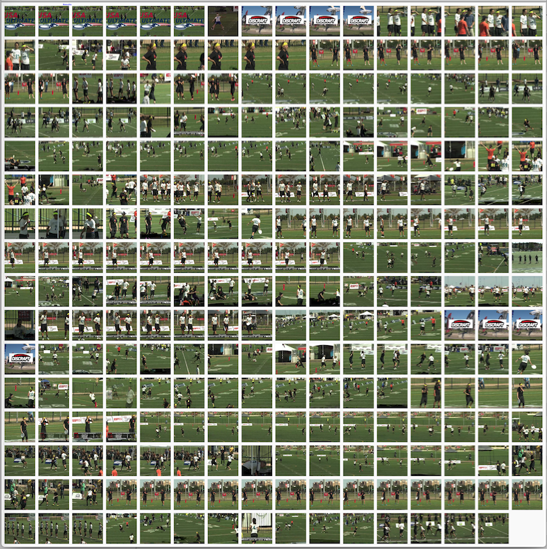

# Experiment #2
## Histograms of Oriented Gradients (HoG)

1. Compute HoGs for the images:
```bash
./HoG.R --cells=1  --bins=9 -o ./data/3_features/HoG_01cells_09bins.csv ./data/2_images/
./HoG.R --cells=4  --bins=9 -o ./data/3_features/HoG_04cells_09bins.csv ./data/2_images/
./HoG.R --cells=9  --bins=9 -o ./data/3_features/HoG_09cells_09bins.csv ./data/2_images/
./HoG.R --cells=16 --bins=9 -o ./data/3_features/HoG_16cells_09bins.csv ./data/2_images/

./HoG.R --cells=1  --bins=9 -o ./data/3_features/HoG_01cells_05bins.csv ./data/2_images/
./HoG.R --cells=4  --bins=9 -o ./data/3_features/HoG_04cells_05bins.csv ./data/2_images/
./HoG.R --cells=9  --bins=9 -o ./data/3_features/HoG_09cells_05bins.csv ./data/2_images/
./HoG.R --cells=16 --bins=9 -o ./data/3_features/HoG_16cells_05bins.csv ./data/2_images/

./HoG.R --cells=25 --bins=9 -o ./data/3_features/HoG_25cells_05bins.csv ./data/2_images/
```

2. Then try re-clustering:

### Find Announcer
Using Histograms of Oriented Gradients:

`$ ./images_like_this.py ./data/2_images/ ./data/0_training/announcer/ ./data/3_features/HoG_09cells_09bins.csv`

### Results -- FAILURE

Found features for 3471 images.
730 features per image.
Given 225 exemplars
  and 337 non-exemplars
Predicted 7 images containing announcers, of which NONE were confirmed by inspection. 

### Find High-Five
Using Histograms of Oriented Gradients:

`$ ./images_like_this.py ./data/2_images/ ./data/0_training/announcer/ ./data/3_features/HoG_09cells_09bins.csv`

### Results -- FAILURE

Found features for 3471 images.
730 features per image.
Given 26 exemplars
  and 39 non-exemplars
Predicted 92 images containing announcers, of which only 7 were confirmed by inspection. 

### Find Disc
In general:

`$ ./images_like_this.py path/to/images/ path/to/exemplars/ feature/file.csv`

Using Histograms of Oriented Gradients:

`$ ./images_like_this.py ./data/2_images/ ./data/0_training/disc/ ./data/3_features/HoG_09cells_09bins.csv`

### Results -- SUCCESS!


Found features for 3471 images.
730 features per image.
Given 125 exemplars
  and 187 non-exemplars
Predicted 255 images containing disc-like objects, of which 187 or 73% were confirmed by inspection to include either a disc or a sign with a picture of a disk.

|Row|Wrong|Right|
|--:|--:|--:|
|1 | 5 | 11 |
|2 | 6 | 10 |
|3 | 8 |  8 |
|4 | 5 | 11 |
|5 | 3 | 13 |
|6 | 1 | 15 |
|7 | 7 |  9 |
|8 | 3 | 13 |
|9 | 9 |  7 |
|10| 3 | 13 |
|11| 4 | 12 |
|12| 9 |  7 |
|13| 0 | 16 |
|14| 1 | 15 |
|15| 1 | 15 |
|16| 3 | 12*|

|      |Wrong|Right|Total|
|------|----:|----:|----:|
|      |68   |187  |255  |

   187/255 = 73.3% correct!

*row 16 has only 15 images

-------------

## Other
[Learning Where to Look](Where-To-Look-Next.md)

[Captioning](Captioning.md)

[Hardware & Configuration](Hardware-And-Config.md)

[Bibliography](Bibliography.md)

[Toolbox](Toolbox.md)
